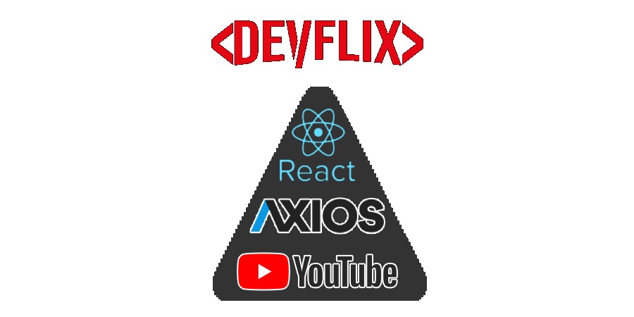

<p align="center">
    
</p>

# 🎥 Devflix
> Assista videos e playlists sobre programação no Devflix.

[![Code Size][code-size]][code-url]
[![License][MIT-license]][MIT-url]
[![Realese][version]][version-url]

Aplicativo mobile feito com React Native para visualização de vídeos e playlists sobre programação, no formato Netflix. 

🇺🇸 [Versão em inglês](../README.md)

## :dart: Objetivo

O objetivo do aplicativo é disponibilizar o conteúdo de aulas e projetos sobre programação de forma mais ágil. Em apenas um click, você terá diversos conteúdos de qualidade, devidamente filtrados para estar na plataforma, estimulando o consumo desse conteúdo, e espalhando conhecimento entre a comunidade de devs.

## :black_nib: Justificativa

Projeto desenvolvido para a matéria de Desenvolvimento de Sistemas para Dispositivos Móveis do SENAI Dendezeiros (Salvador, BA).

## :construction_worker: Instalação

Clone o repositório:

```git
git clone https://github.com/gcairesdev/projeto
```

Abra a pasta do projeto:

```shell
cd devflix
```

Instale as dependências:

```shell
npm install
```

## Arquitetura (Requerido em aula)

Uma simples representação de como são usadas algumas tecnologias no Devflix.

[a](img/architecture.png)


A aplicação é desenvolvida com React Native, e através do axios utiliza-se da API do Youtube para exibir os vídeos e playlists que compõem o app.

## 👨🏼‍💻 Autor

Foto | Nome | GitHub | Likedin | E-mail
---- | ---- | ------ | ------- | ------
 | Guilherme Caires | [gcairesdev](https://github.com/gcairesdev) | [Linkedin](https://linkedin.com/in/guilherme-caires/) | contatogcaires@gmail.com

## 🤝 Contribuindo

Confira a página [CONTRIBUTING](./CONTRIBUTING-PT-BR.md) para ver os melhores locais para arquivar problemas, iniciar discussões e começar a contribuir

## :page_facing_up: Licença

Distribuído sob a licença MIT.  Veja a [LICENÇA] (.github/LICENSE.md) para mais informações.

Lançado em 2020.
Este projeto está sob a [Licença MIT](.github/LICENSE.md).

---

<p align="center">
    Feito com :heart: por <a href="https://github.com/gcairesdev">Guilherme Caires</a>
</p>

<!-- Markdown link & img dfn's -->
[code-size]: https://img.shields.io/github/languages/code-size/gcairesdev/devflix
[code-url]: https://github.com/gcairesdev/devflix

[MIT-license]: https://img.shields.io/github/license/gcairesdev/devflix
[MIT-url]: https://github.com/gcairesdev/devflix/blob/master/LICENSE.md

[version]: https://img.shields.io/github/v/release/gcairesdev/devflix?include_prereleases
[version-url]: https://github.com/gcairesdev/devflix