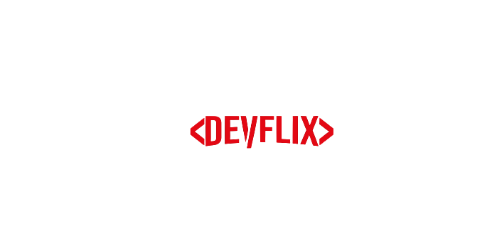

<p align="center">
    
</p>

# 🎥 Devflix
> Watch videos and playlists about programming on Devflix.

[![Code Size][code-size]][code-url]
[![License][MIT-license]][MIT-url]
[![Realese][version]][version-url]

Mobile application made with React Native for viewing videos and playlists about programming, in Netflix format.

🇧🇷 [Portuguese version](./.github/README-PT-BR.md)

## :dart: Objective

The purpose of the application is to make the content of classes and projects on programming more agile.  In just one click, you will have several quality content, properly filtered to be on the platform, encouraging the consumption of that content, and spreading knowledge among the dev community.

## :black_nib: Justification

Project developed for the subject of Systems Development for Mobile Devices at SENAI Dendezeiros (Salvador, BA).

## :construction_worker: Installation

Clone repository:

```git
git clone https://github.com/gcairesdev/project
```

Open project directory:

```shell
cd devflix
```

Install the dependencies:

```shell
npm install
```

## 👨🏼‍💻 Author

Photo | Name | GitHub | Likedin | E-mail
---- | ---- | ------ | ------- | ------
 | Guilherme Caires | [gcairesdev](https://github.com/gcairesdev) | [Linkedin](https://linkedin.com/in/guilherme-caires/) | contatogcaires@gmail.com

## 🤝 Contributing

Check out the [CONTRIBUTING](.github/CONTRIBUTING.md) page to see the best places to file issues, start discussions and begin contributing.

## :page_facing_up: License

Released in 2020.
This project is under the [MIT license](.github/LICENSE.md).

---

<p align="center">
    Made with :heart: by <a href="https://github.com/gcairesdev">Guilherme Caires</a>
</p>

<!-- Markdown link & img dfn's -->
[code-size]: https://img.shields.io/github/languages/code-size/gcairesdev/devflix
[code-url]: https://github.com/gcairesdev/devflix

[MIT-license]: https://img.shields.io/github/license/gcairesdev/devflix
[MIT-url]: https://github.com/gcairesdev/devflix/blob/master/LICENSE.md

[version]: https://img.shields.io/github/v/release/gcairesdev/devflix?include_prereleases
[version-url]: https://github.com/gcairesdev/devflix